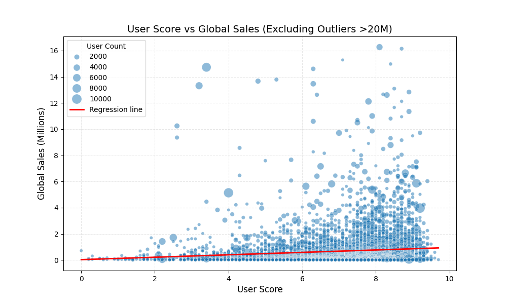
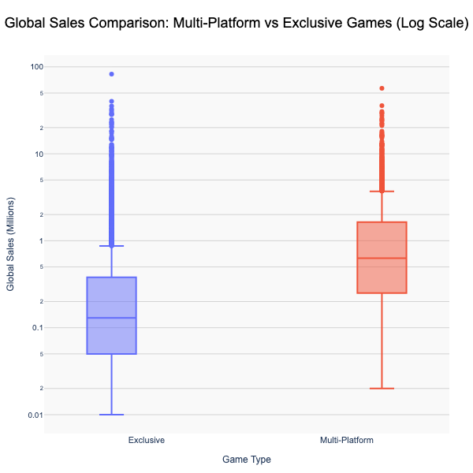
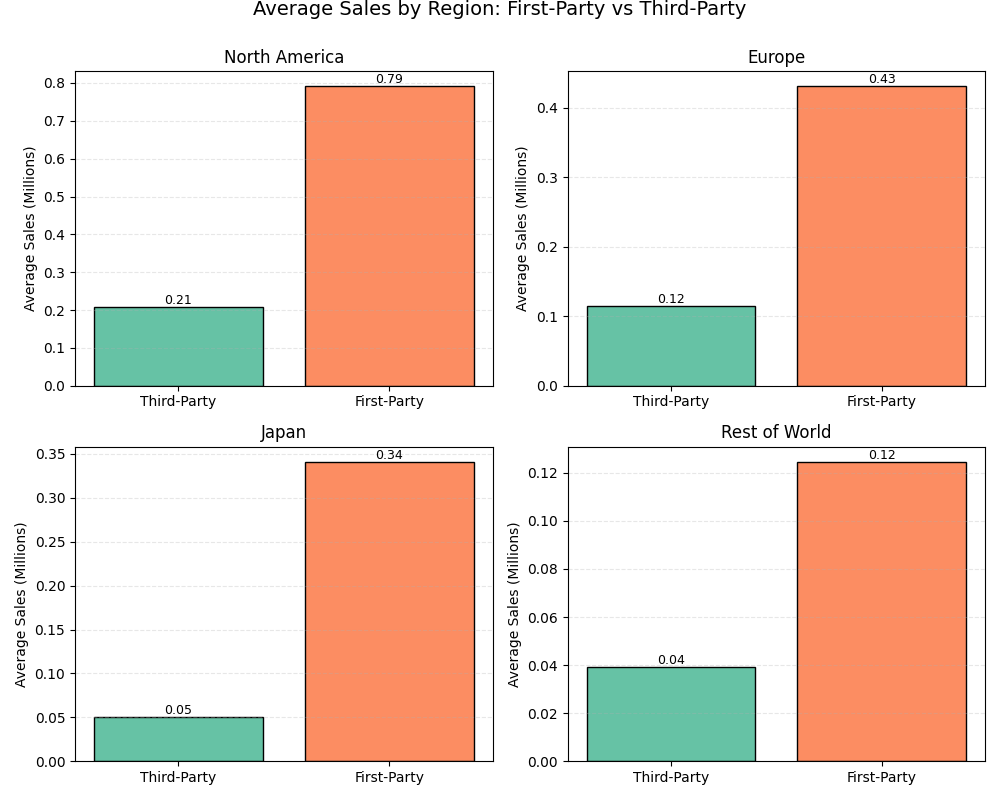
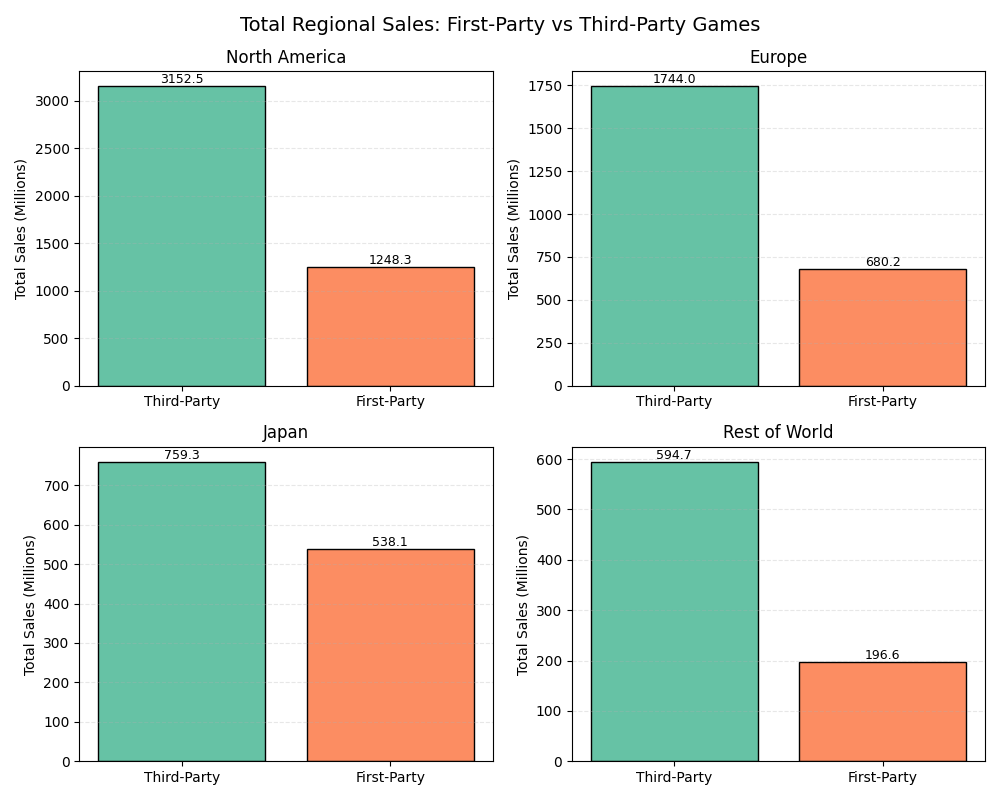
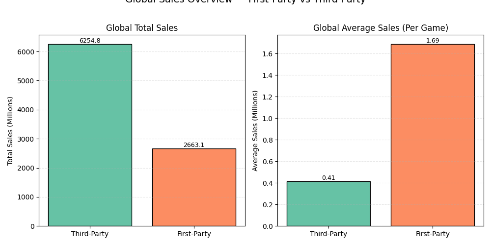

# View of Saved Plots and Visualisations

Below is an overview of all the visualisations created and saved during the analysis.

### 1. Global Sales Trends Over Time
  
Shows total **Global_Sales** by `Year_of_Release`. Highlights industry growth, peaks during Wii/DS & PS2/PS3 era, and the decline in recent years.

---

### 2. Average Global Sales Per Game Over Time
  
Displays average **Global_Sales per game** by `Year_of_Release`. Smooths out volume spikes to show how the typical game’s sales changed over time.

---

### 3. Critic Score vs Global Sales
  
Scatter plot showing `Critic_Score` vs `Global_Sales`. Bubble size = `Critic_Count`. Includes regression line and outliers.

---

### 4. Critic Score vs Global Sales (Filtered Outliers >20M)
  
Same as above but excludes games selling >20M units to reduce distortion and better reveal the general trend.

---

### 5. User Score vs Global Sales
  
Scatter plot showing User_Score vs `Global_Sales`. Bubble size = `User_Count` includes regression line and outliers.

---

### 6. User Score vs Global Sales (Filtered Outliers >20M)
  
Scatter plot showing User_Score vs `Global_Sales`. Bubble size = `User_Count` excludes regression line and outliers.

---

### 7. Total Regional Game Sales by Platform Vendor
  
Barplot showing total sales per platform venor by region

---

### 8. Average Regional Game Sales by Platform Vendor
  
Barplot showing average (mean) sales per platform venor by region

---

### 9. Global Sales Comparison: Multi-Platform vs Exclusive Games (Log Scale)
  
Box plot comparing Multi-Platform vs Exclusive Games Sales 

---

### 10. Average Sales by Region - First party vs Third party
  
Bar charts comparing the average sales per game for first-party and third-party titles across all major regions.

---

### 11. Total Regional Sales - First party vs Third party
  
Bar charts showing total cumulative sales for first-party and third-party games in each global region.

---

### 12. Global Sales Overview - First party vs Third party
  
Side-by-side comparison of total and average global sales for first-party and third-party games.

---
