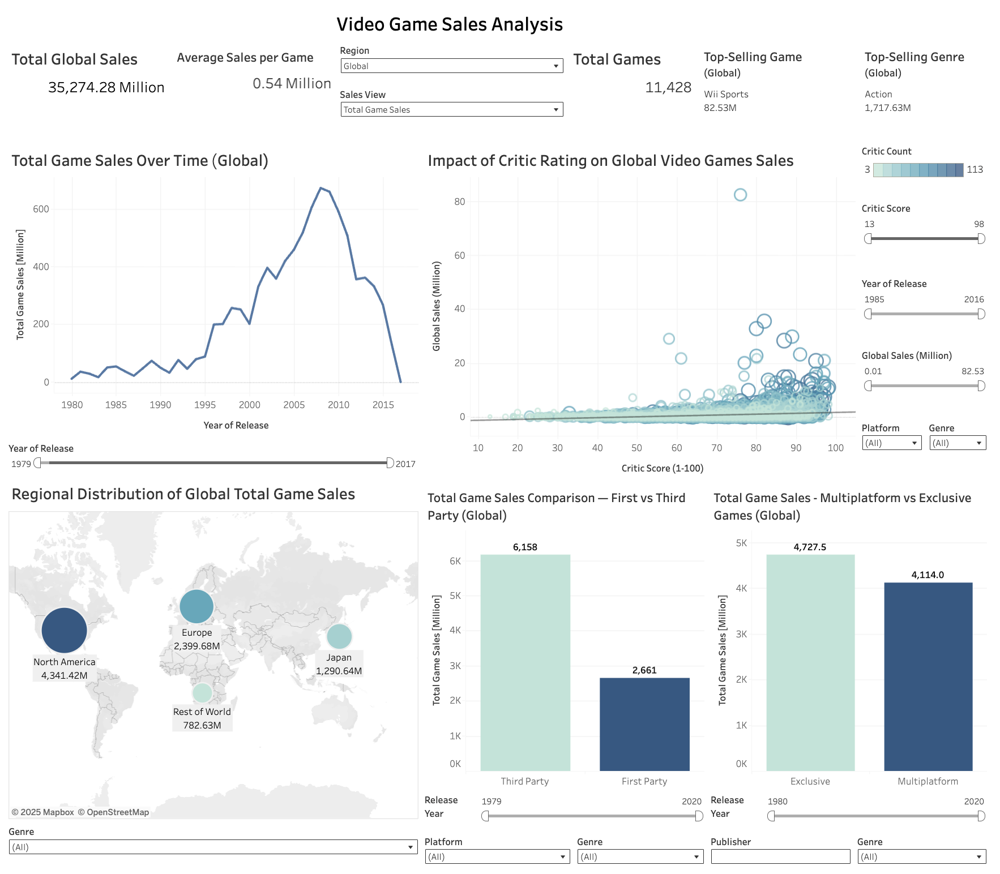

# Video Game Sales Analysis

**Video Game Sales Analysis** is a data-driven research project designed to investigate global video game market performance using statistical analysis and interactive visualisation. The project explores how factors such as **region, platform strategy, genre, and critic reception** influence sales outcomes. By combining **Python-based exploratory analysis** with an interactive **Tableau dashboard**, it enables users to drill down into trends, compare publishing strategies, and validate industry hypotheses with evidence.

---

<strong style="font-size: 1.5em;">Table of Contents (Click to Expand)</strong>

- [Dataset Content](#dataset-content)
- [Structure](#structure)
- [Data Quality](#data-quality)
- [Example Records](#example-records)
- [Business Requirements](#business-requirements)
- [Hypotheses and How to Validate](#hypothesis-and-how-to-validate)
  - [Hypothesis 1 — Critic Reviews Drive Sales](#hypothesis-1--critic-reviews-drive-sales)
  - [Hypothesis 2 — User Reviews Drive Sales](#hypothesis-2--user-reviews-drive-sales)
  - [Hypothesis 3 — Platform Strength Varies by Region](#hypothesis-3--platform-strength-varies-by-region)
  - [Hypothesis 4 — Multi-Platform Advantage](#hypothesis-4--multi-platform-advantage)
  - [Hypothesis 5 — First-Party Advantage](#hypothesis-5--first-party-advantage)
- [Project Plan](#project-plan)
  - [Sprint Timeline](#sprint-timeline)
  - [How I Managed the Data](#how-i-managed-the-data)
  - [Why I Chose These Research Methodologies](#why-i-chose-these-research-methodologies)
- [The Rationale to Map Business Requirements to Data Visualisations](#the-rationale-to-map-the-business-requirements-to-the-data-visualisations)
- [Analysis Techniques Used](#analysis-techniques-used)
- [Ethical Considerations](#ethical-considerations)
- [Dashboard](#dashboard)
  - [Dashboard Wireframe](#dashboard-wireframe)
  - [Dashboard Design Choices](#dashboard-design-choices)
  - [Dashboard Pages](#dashboard-pages)
- [Unfixed Bugs](#unfixed-bugs)
- [Development Roadmap](#development-roadmap)
  - [Project Challenges](#project-challenges)
  - [Future Developments](#future-developments)
  - [Commitment to Continuous Improvement](#commitment-to-continuous-improvement)
- [Main Data Analysis Libraries](#main-data-analysis-libraries)
- [Credits](#credits)
  - [Content](#content)
  - [Media](#media)
- [Additional Information & Definitions](#additional-information--definitions)
  - [Core Statistical Concepts](#core-statistical-concepts)
  - [Statistical Tests & Methods Used](#statistical-tests--methods-used)

---

### Useful Links
 - [Interactive Dashboard](https://public.tableau.com/app/profile/stephen.beese/viz/Video_Game_Dashboard_17601098705760/VideoGameSalesAnalysisDashboard?publish=yes)
 - [Graphs](PLOTS.md)
 - [Data Examples](jupyter_notebooks/display_data.ipynb)
 - [ETL Notebook](jupyter_notebooks/etl.ipynb)
 - [Visualisation Notebook](jupyter_notebooks/visualisations.ipynb)
 - [Final Conclusions](jupyter_notebooks/visualisations.ipynb#final-conclusions)

## Dataset Content

This dataset provides information about **video game sales, platforms, publishers, and review scores**, enabling analysis of market trends, platform performance, and the relationship between reviews and sales.

You can find the source of this dataset [here](https://www.kaggle.com/datasets/sidtwr/videogames-sales-dataset?select=Video_Games_Sales_as_at_22_Dec_2016.csv)

## Structure

* **Rows:** 16,719
* **Columns:** 16

| Column            | Data Type | Description                                                    |
| ----------------- | --------- | -------------------------------------------------------------- |
| `Name`            | `object`  | Title of the video game                                        |
| `Platform`        | `object`  | Platform(s) where the game was released (e.g., Wii, PS4, X360) |
| `Year_of_Release` | `float64` | Release year of the game (some missing values)                 |
| `Genre`           | `object`  | Game genre (e.g., Sports, Action, Role-Playing)                |
| `Publisher`       | `object`  | Company that published the game                                |
| `NA_Sales`        | `float64` | Sales in North America (millions of units)                     |
| `EU_Sales`        | `float64` | Sales in Europe (millions of units)                            |
| `JP_Sales`        | `float64` | Sales in Japan (millions of units)                             |
| `Other_Sales`     | `float64` | Sales in other regions (millions of units)                     |
| `Global_Sales`    | `float64` | Total worldwide sales (millions of units)                      |
| `Critic_Score`    | `float64` | Average critic review score (0–100)                            |
| `Critic_Count`    | `float64` | Number of critic reviews                                       |
| `User_Score`      | `float64` | Average user review score (0–10)                               |
| `User_Count`      | `float64` | Number of user ratings                                         |
| `Developer`       | `object`  | Company that developed the game                                |
| `Rating`          | `object`  | ESRB rating (e.g., E, T, M)                                    |

---

<a href="#video-game-sales-analysis">Back to Top</a>

## Data Quality

* **Complete:** Sales columns (`NA_Sales`, `EU_Sales`, `JP_Sales`, `Other_Sales`, `Global_Sales`).
* **Partially missing:**

  * `Critic_Score` & `Critic_Count` — ~50%
  * `User_Score` & `User_Count` — ~55%
  * `Developer` & `Rating` — ~40%
  * `Year_of_Release` — 269 rows

You can view the Data Profiling in the [ETL notebook](jupyter_notebooks/etl.ipynb#data-profiling)

---

<a href="#video-game-sales-analysis">Back to Top</a>

## Example Records ([video_game_sales.csv](data/raw/video_game_sales.csv))

---

<a href="#video-game-sales-analysis">Back to Top</a>

## Business Requirements

The aim of this project is to clean, transform, and analyse historical video game sales data to support decision-making within the games industry.  
The key requirements are:

- **Understand sales performance** — Provide clear insights into global and regional sales trends (NA, EU, JP, Other) to identify high-performing games and platforms.
- **Platform strategy** — Compare sales across consoles and publishers to guide platform investment (e.g., Nintendo vs Sony vs Microsoft vs Other).
- **First-party vs third-party performance** — Identify how first-party titles perform compared with third-party titles to inform partnerships and exclusivity decisions.
- **Release planning** — Analyse the relationship between release year and sales to help forecast the potential success of upcoming game launches.
- **Data quality and consistency** — Clean and standardise raw data by handling missing values, merging duplicates, and creating derived features (e.g., `is_multiplatform`, `is_first_party`).
- **Flexible data exports** — Provide multiple cleaned CSV outputs for different analysis needs:
  - Sales-only dataset (no review data)
  - Merged multi-platform dataset (one row per title)
  - Review-focused dataset (only games with critic/user review data)

This analysis will help **publishers, developers, and analysts** make evidence-based decisions about platform focus, partnerships, and release timing.

<a href="#video-game-sales-analysis">Back to Top</a>

## Hypothesis and how to validate

### Hypothesis 1 — **Critic reviews drive sales**

> Games with higher critic scores are associated with higher global sales.

* **Preparation:** Filter out rows with missing `Critic_Score`.
* **Validation:**

  * Visualise a scatter plot of `Critic_Score` vs `Global_Sales` with a regression line.
  * Bubble size represents `Critic_Count`.
* **Acceptance criteria:** A statistically significant positive correlation (p < 0.05) and a meaningful effect size (e.g., a 10-point increase in critic score results in a noticeable sales uplift).

- [Hypothesis 1 - Visualisation and Testing](jupyter_notebooks/visualisations.ipynb#hypothesis-1---critic-reviews-drive-sales)

---

<a href="#video-game-sales-analysis">Back to Top</a>

### Hypothesis 2 — **User reviews drive sales**

> Games with higher user scores are associated with higher global sales.

* **Preparation:** Filter out rows with missing `User_Score`.
* **Validation:**

  * Scatter plot of `User_Score` vs `Global_Sales` with regression line.
  * Bubble size represents `User_Count`.
* **Acceptance criteria:** A statistically significant positive correlation (p < 0.05) between user score and sales.

- [Hypothesis 2 – Visualisation and Testing](jupyter_notebooks/visualisations.ipynb#hypothesis-2--user-reviews-drive-sales)

---

<a href="#video-game-sales-analysis">Back to Top</a>

### Hypothesis 3 — **Platform strength varies by region**

> Nintendo platforms outperform in Japan, while Sony and Microsoft dominate in North America and Europe.

* **Preparation:** Map platforms to vendors (Nintendo, Sony, Microsoft, Other).
* **Validation:**

  * Grouped bar charts of `JP_Sales`, `NA_Sales` and `EU_Sales` by vendor.
  * Use ANOVA and post-hoc Tukey tests to confirm differences between vendors.
* **Acceptance criteria:** Nintendo’s average sales are significantly higher in Japan, while Sony/Microsoft show higher averages in NA and EU.

- [Hypothesis 3 – Visualisation and Testing](jupyter_notebooks/visualisations.ipynb#hypothesis-3--platform-strength-varies-by-region)

---

<a href="#video-game-sales-analysis">Back to Top</a>

### Hypothesis 4 — **Multi-platform advantage**

> Games released on multiple platforms sell more globally than single-platform titles.

* **Preparation:** Create a boolean column `is_multiplatform` (True if a game is available on ≥2 platforms).
* **Validation:**

  * Boxplots or violin plots comparing `Global_Sales` for multi-platform vs single-platform games.
* **Acceptance criteria:** Multi-platform games show significantly higher global sales (e.g., Mann–Whitney U or t-test).

- [Hypothesis 4 – Visualisation and Testing](jupyter_notebooks/visualisations.ipynb#hypothesis-4--multi-platform-advantage)

---

<a href="#video-game-sales-analysis">Back to Top</a>

### Hypothesis 5 — **First-party advantage**

> First-party games (published by the platform owner) outperform third-party titles on the same platform.

* **Preparation:** Create `is_first_party` column by checking if publisher matches platform owner (e.g., Nintendo on Wii/DS, Sony on PlayStation, Microsoft on Xbox).
* **Validation:**

  * Bar charts comparing mean `Global_Sales` for first-party vs third-party games, grouped by platform vendor.
* **Acceptance criteria:** First-party games have significantly higher mean sales on their respective platforms (t-test or Mann–Whitney U).

- [Hypothesis 5 – Visualisation and Testing](jupyter_notebooks/visualisations.ipynb#hypothesis-5--first-party-advantage)

---

<a href="#video-game-sales-analysis">Back to Top</a>

## Project Plan

This project follows an **agile, sprint-based approach**, breaking the work into small, focused iterations to ensure quality, flexibility, and timely delivery. Early sprints concentrated on preparing and validating the dataset so that later sprints can focus on deeper analysis, hypothesis testing, and presenting insights effectively. The final deliverables include a fully cleaned and engineered dataset, validated analytical findings, and an interactive **Tableau dashboard**.

### Sprint Timeline

| Sprint / High Level Steps                                                  | Date(s)         | Goals                                                                                                                                                                                |
| ------------------------------------------------------- | --------------- | --------------------------------------------------------------------------------------------------------------------------------------------------------------------------------------------- |
| **Sprint 1 — ETL, Data Cleaning & Feature Engineering** | **07 Oct**      | Extract and import raw data, clean missing or invalid values, drop unused fields, convert column types, and create new engineered features (`is_multiplatform`, `is_first_party`).            |
| **Sprint 2 — Data Validation & Quality Checks**         | **08 Oct**      | Validate the integrity of the cleaned dataset (check for duplicates, outliers, and inconsistencies) and confirm the correctness of new features.                                              |
| **Sprint 3 — Exploratory Analysis & Visualisation**     | **08 – 09 Oct** | Explore sales trends by region, platform, and publisher. Build quick visualisations to understand distributions and relationships between key variables. Prepare data for Tableau dashboards. |
| **Sprint 4 — Hypothesis Testing & Insights**            | **10 Oct**      | Statistically test hypotheses such as *reviews driving sales*, *multi-platform advantage*, and *first-party vs third-party performance*. Summarise findings and actionable insights.          |
| **Sprint 5 — Dashboard Development**                    | **11 – 12 Oct** | Build an interactive Tableau dashboard to present sales patterns, platform comparisons, and review-driven trends in a clear, business-friendly format.                                        |
| **Sprint 6 — Documentation & Wrap-up**                  | **13 Oct**      | Finalise the README with business requirements, methodology, and insights. Export cleaned CSV datasets and prepare the project for handover or stakeholder review.                            |

The project was structured around **user stories**, managed through a [GitHub Kanban board](https://github.com/users/stephenbeese/projects/11/views/1) to maintain accountability and progress tracking. Each sprint delivered a specific analytical milestone, ensuring continuous refinement and adaptation based on findings.

Screenshots of the Kanban board during the development process can be found [here](images/kanban/).

---

### **How I Managed the Data**

* **Collection:** Raw game sales data was collected from a trusted Kaggle source.
* **Processing:** During ETL, I cleaned missing scores, standardised platforms, and engineered meaningful features.
* **Analysis:** The cleaned dataset was versioned into separate analytical subsets (critic review, user review, first-party, merged), ensuring modular and reusable workflows.
* **Interpretation:** Findings were supported with statistical evidence and visualisations, avoiding assumptions and focusing on data-driven conclusions.

Throughout the project, the data journey was fully traceable—from raw input to finished insights—ensuring reliability and reproducibility.

---

### **Why I Chose These Research Methodologies**

I chose a **quantitative, hypothesis-driven approach** to focus on measurable commercial patterns rather than subjective opinions. This approach allowed me to:

* Use **statistical validation** (e.g. ANOVA, t-tests) to support or reject assumptions with evidence.
* Compare groups objectively (e.g. first-party vs third-party, single-platform vs multi-platform).
* Provide actionable insights for business stakeholders—such as publishers or platform owners—who require clear performance indicators rather than exploratory speculation.

The combination of **EDA + hypothesis testing** ensures that the project is both exploratory and evaluative, offering not only what the data shows but *why it matters* commercially.

<a href="#video-game-sales-analysis">Back to Top</a>

## The rationale to map the business requirements to the Data Visualisations

The visualisations in this project were designed to directly address the core business requirements by turning raw sales data into meaningful commercial insights. Each chart serves a specific strategic question relevant to publishers, platform holders, and decision-makers in the games industry.

| **Business Requirement**                              | **Mapped Visualisation(s)**                                                                                                                                                                                                                | **Rationale**                                                                                                               |
| ----------------------------------------------------- | ------------------------------------------------------------------------------------------------------------------------------------------------------------------------------------------------------------------------------------------ | --------------------------------------------------------------------------------------------------------------------------- |
| **Understand global and regional sales performance**  | [**Global Sales Trends Over Time**](PLOTS.md#1-global-sales-trends-over-time), [**Average Global Sales Per Game**](PLOTS.md#2-average-global-sales-per-game-over-time)                                                                     | Identifies long-term market trends, growth periods, and industry decline to support forecasting and strategic timing.       |
| **Platform strategy (Nintendo vs Sony vs Microsoft)** | [**Total Regional Sales by Platform Vendor**](PLOTS.md#7-total-regional-game-sales-by-platform-vendor), [**Average Regional Sales by Platform Vendor**](PLOTS.md#8-average-regional-game-sales-by-platform-vendor)                         | Helps benchmark platform performance across regions, guiding platform investment and partnership decisions.                 |
| **First-party vs third-party performance**            | [**Average Sales by Region – First vs Third Party**](PLOTS.md#10-average-sales-by-region---first-party-vs-third-party), [**Global Sales Overview – First vs Third Party**](PLOTS.md#12-global-sales-overview---first-party-vs-third-party) | Assesses whether platform-owned titles outperform third-party releases, informing exclusivity and publishing strategy.      |
| **Multi-platform release strategy**                   | [**Multi-Platform vs Exclusive Sales (Log Scale)**](PLOTS.md#9-global-sales-comparison-multi-platform-vs-exclusive-games-log-scale)                                                                                                        | Evaluates whether releasing across multiple platforms increases commercial reach and sales consistency.                     |
| **Review impact on sales (critic & user perception)** | [**Critic Score vs Global Sales**](PLOTS.md#3-critic-score-vs-global-sales), [**User Score vs Global Sales**](PLOTS.md#5-user-score-vs-global-sales)                                                                                       | Tests whether critical reception or player sentiment drives commercial success, supporting marketing and quality decisions. |
| **Release planning & lifecycle strategy**             | [**Global Sales Trends Over Time**](PLOTS.md#1-global-sales-trends-over-time), [**Average Sales Over Time**](PLOTS.md#2-average-global-sales-per-game-over-time)                                                                           | Helps determine which release years were most commercially successful and whether industry peaks affect launch timing.      |

### Strategic Role of Visual Mapping

By aligning visualisations with business requirements, this project ensures that insights are practical and decision-ready. Each chart is built to answer a commercial question — helping stakeholders move from data to direction.

<a href="#video-game-sales-analysis">Back to Top</a>

## Analysis techniques used
* List the data analysis methods used and explain limitations or alternative approaches.
* How did you structure the data analysis techniques. Justify your response.
* Did the data limit you, and did you use an alternative approach to meet these challenges?
* How did you use generative AI tools to help with ideation, design thinking and code optimisation?

<a href="#video-game-sales-analysis">Back to Top</a>

## Ethical considerations

## **Ethical Considerations**

This project uses publicly available historical video game sales data, which does not include any personal or sensitive information. As such, there are **no direct data privacy concerns** related to GDPR or individual user rights. However, ethical responsibility still applies in terms of **fairness, representation, and interpretation** of insights.

### **Bias and Fairness**

The dataset primarily represents sales figures from major commercial platforms and publishers. This introduces potential **industry bias**, as:

* Independent and niche developers are underrepresented.
* Sales are heavily skewed towards Western and Japanese markets.
* Review scores often reflect critic and user opinions from dominant regions, which may not represent global sentiment.

To mitigate misinterpretation:

* Findings are framed at an **industry level**, not as universal truths about game quality or cultural preference.
* Statistical trends were analysed cautiously, prioritising *context* over raw correlation.

### **Responsible Interpretation**

Sales performance does not reflect artistic or cultural value. High sales may be influenced by marketing budgets, franchise recognition, or platform exclusivity—not necessarily game quality. Therefore:

* Insights were presented with emphasis on **commercial trends**, not judgements of creative merit.
* Hypotheses are supported by evidence but leave room for external industry factors.

### **Legal and Usage Compliance**

The dataset originates from an open-source platform (e.g. Kaggle) with usage permitted for educational and non-commercial analysis. No proprietary or confidential data was used. All data manipulation, visualisation, and interpretation were carried out within ethical and legal standards expected in data analytics.

<a href="#video-game-sales-analysis">Back to Top</a>

## Dashboard

You can find a link to my interactive Tableau dashboard [here](https://public.tableau.com/app/profile/stephen.beese/viz/Video_Game_Dashboard_17601098705760/VideoGameSalesAnalysisDashboard?publish=yes)

### Dashboard Wireframe

---

<a href="#video-game-sales-analysis">Back to Top</a>

## Dashboard Design Choices 

The *Video Game Sales Analysis Dashboard* was designed to explore the hypothesis that **video game performance is influenced by region, platform strategy, and critic reception**. The layout follows a top-down approach, moving from global insights to detailed comparisons, enabling both casual viewers and analysts to draw meaningful conclusions.

---

### Top-Level KPIs for Immediate Insight

At the top, headline metrics such as **Total Global Sales, Average Sales per Game, Total Games, and Top-Selling Genre/Game** provide instant context. These KPIs quickly answer high-level questions and set the stage for more detailed exploration, supporting an understanding of overall market scale.

### Global Trends Over Time

The **Sales Over Time** chart visualises the evolution of industry performance. This helps reveal whether market growth aligns with major releases, changing generations, or critical reception.

### Regional Variation & Market Preferences

A **global map** illustrates sales distribution by region (e.g., North America, Europe, Japan). This enables hypotheses testing around regional preferences—such as whether certain regions favour exclusive titles, franchises, or specific genres.

### Critic Influence & Sales Correlation

The **Critic Score vs Global Sales** scatterplot examines whether highly-rated games perform better commercially. Outliers and clusters help reveal cases where brand power outweighs critic scores or where critical success translates to strong sales.

### First vs Third Party & Multiplatform vs Exclusive

Comparative bar charts allow users to analyse platform strategy:

* **First vs Third Party** (publisher impact),
* **Multiplatform vs Exclusive** (distribution strategy).

These visuals support strategic conclusions about reach, brand loyalty, and market penetration.

### Filters for Deeper Exploration

Interactive filters such as **Region, Year, Genre, Platform, and Sales View (Total vs Average)** empower users to **drill down** and personalise analysis. This flexibility makes it possible to test the hypothesis across multiple dimensions—transforming the dashboard into a dynamic exploration tool rather than a static summary.

### Final Thought

The dashboard was deliberately structured to make **complex insights accessible**. By combining KPIs, trends, comparisons, and interactive controls, it enables both technical and non-technical audiences to uncover patterns, challenge assumptions, and draw informed conclusions about what drives video game success.

<a href="#video-game-sales-analysis">Back to Top</a>

### Dashboard pages

| Page Name                                        | Chart Type(s)                        | Description                                                                 | Link |
|--------------------------------------------------|--------------------------------------|-----------------------------------------------------------------------------|------|
| **Sales Over Time**                               | Line Chart                           | Shows sales trends over time, filtered by region and year.                  | [View Sheet](https://public.tableau.com/app/profile/stephen.beese/viz/Video_Game_Dashboard_17601098705760/SalesOverTime?publish=yes) |
| **Total Global Sales**                            | KPI / Text Card                      | Displays the total cumulative sales of all games across selected regions.   | [View Sheet](https://public.tableau.com/app/profile/stephen.beese/viz/Video_Game_Dashboard_17601098705760/TotalGlobalSales?publish=yes) |
| **Average Sales per Game**                        | KPI / Text Card                      | Shows average sales per game (Total sales ÷ number of games).               | [View Sheet](https://public.tableau.com/app/profile/stephen.beese/viz/Video_Game_Dashboard_17601098705760/AverageSalesperGame?publish=yes) |
| **Regional Distribution of Video Games Sales**    | Map (Symbol/Filled)                  | Visualises geographic distribution of sales across global regions.          | [View Sheet](https://public.tableau.com/app/profile/stephen.beese/viz/Video_Game_Dashboard_17601098705760/RegionalDistributionofVideoGamesSales?publish=yes) |
| **Impact of Critic Rating on Global Video Games Sales** | Scatter Plot + Trendline      | Analyses correlation between critic scores and sales performance.           | [View Sheet](https://public.tableau.com/app/profile/stephen.beese/viz/Video_Game_Dashboard_17601098705760/ImpactofCriticRatingonGlobalVideoGamesSales?publish=yes) |
| **Sales Comparison – First vs Third Party**       | Bar Chart                            | Compares sales of first-party vs third-party published games.               | [View Sheet](https://public.tableau.com/app/profile/stephen.beese/viz/Video_Game_Dashboard_17601098705760/SalesComparison-FirstvsThirdParty?publish=yes) |
| **Sales Comparison – Multiplatform vs Exclusive** | Bar Chart                            | Compares performance between exclusive and multiplatform titles.            | [View Sheet](https://public.tableau.com/app/profile/stephen.beese/viz/Video_Game_Dashboard_17601098705760/SalesComparison-MultiplatformvsExclusive?publish=yes) |
| **Total Games**                                   | KPI / Text Card                      | Shows total number of games under current region and filters.               | [View Sheet](https://public.tableau.com/app/profile/stephen.beese/viz/Video_Game_Dashboard_17601098705760/TotalGames?publish=yes) |
| **Top-Selling Game**                              | KPI / Text Card                      | Displays the highest-selling video game dynamically by region.              | [View Sheet](https://public.tableau.com/app/profile/stephen.beese/viz/Video_Game_Dashboard_17601098705760/TopSellingGame?publish=yes) |
| **Top-Selling Genre**                             | KPI / Text Card                      | Shows the genre with the highest total sales in selected region.            | [View Sheet](https://public.tableau.com/app/profile/stephen.beese/viz/Video_Game_Dashboard_17601098705760/TopSellingGenre?publish=yes) |
| **Video Game Sales Analysis Dashboard**           | Full Interactive Dashboard           | Combined dashboard containing all KPIs, charts, and interactive filters.    | [View Full Dashboard](https://public.tableau.com/app/profile/stephen.beese/viz/Video_Game_Dashboard_17601098705760/VideoGameSalesAnalysisDashboard?publish=yes) |

The Tableau Workbook file can be found [here](dashboards/Video_Game_Dashboard.twbx). It can be uploaded to Tableau public so you can reproduce the results yourself.

<a href="#video-game-sales-analysis">Back to Top</a>

## Unfixed Bugs

* Please mention unfixed bugs and why they were not fixed. This section should include shortcomings of the frameworks or technologies used. Although time can be a significant variable to consider, paucity of time and difficulty understanding implementation are not valid reasons to leave bugs unfixed.
* Did you recognise gaps in your knowledge, and how did you address them?
* If applicable, include evidence of feedback received (from peers or instructors) and how it improved your approach or understanding.

<a href="#video-game-sales-analysis">Back to Top</a>

## Development Roadmap

### Project Challenges

| **Challenge**                                                                                             | **Strategy to Overcome**                                                                                                                                                                                  |
| --------------------------------------------------------------------------------------------------------- | --------------------------------------------------------------------------------------------------------------------------------------------------------------------------------------------------------- |
| **Complex Data Cleaning & Merging** (multiple sources with missing values, inconsistent platform formats) | Used **Pandas** to standardise fields, merge and split data, and create new calculated fields such as `is_multiplatform`. |
| **Region Filtering Not Working in Tableau** (due to long-format region/sales fields)                      | Designed a **Region Selector parameter** with calculated logic to dynamically control which region metric was displayed.                                                           |
| **Calculating Accurate Averages per Game**                                                                | Used **LOD expressions** (`{ FIXED }`) to compute game-level totals and counts, preventing aggregation errors and ensuring accurate average sales in Tableau.                                             |
| **Visual clarity with overlapping scatter points** (Critic Score vs Sales)                                | Introduced **mark transparency**, sorted axes, and tooltips with context (Number of Reviews, Title) to enhance readability and interpretability.                                                          |
| **Validating Hypothesis (e.g. Critic influence, Genre dominance)**                                        | Applied Python **statistical testing** (`ANOVA`, `Tukey HSD`, `t-test`, `linregress`) before visualisation to ensure dashboard insights were statistically valid, not just visual patterns.               |

### Future Developments

| **Area for Growth**              | **Planned Skill/Tool to Learn**                 | **Reason**                                                                                        |
| -------------------------------- | ----------------------------------------------- | ------------------------------------------------------------------------------------------------- |
| Advanced Dashboard Interactivity | **Tableau Actions, Parameters & Set Controls**  | To enable cross-chart interactions (e.g. clicking a genre to isolate it across all charts).       |
| Predictive Analytics             | **Machine Learning (Regression, Forecasting)**  | To explore predictive sales modelling based on critic scores, platform, genre, and region trends. |
| Data Engineering                 | **SQL & Cloud Databases (BigQuery/PostgreSQL)** | For handling larger datasets and automating data pipelines rather than manual CSV imports.        |
| Visual Design & UX               | **Figma / Tableau UX Best Practices**           | To further improve storytelling and layout consistency in dashboards for professional delivery.   |
| Update Dataset                   | **Web Scraping / API Integration**              | To ensure the dataset remains current by automatically adding new game releases and sales updates.|

### Commitment to Continuous Improvement

As the games industry continues to evolve, I am committed to expanding both my technical capabilities and analytical mindset. Future updates to this project will focus not only on enhancing visual storytelling, but also on incorporating automation, predictive modelling, and real-time data sourcing. By progressing into areas such as machine learning, API integration, and advanced dashboard interactivity, I aim to transform this work from a static analysis into a dynamic, scalable decision-support tool. This project marks the beginning of a longer journey in data analytics, where I will continue to iterate, adapt, and experiment with new methods and technologies.

<a href="#video-game-sales-analysis">Back to Top</a>

## Main Data Analysis Libraries

| **Library / Function**                | **How It Was Used in the Project**                                                                                                                                                             |
| ------------------------------------- | ---------------------------------------------------------------------------------------------------------------------------------------------------------------------------------------------- |
| **Python**                            | Main programming language used for data preprocessing, statistical testing, and exploratory visualisation prior to dashboard development.                                                      |
| **Pandas**                            | Used for data loading, cleaning, merging datasets, handling missing values, and preparing data frames for analysis and export to Tableau.                                                      |
| **NumPy**                             | Provided array-based operations and numerical calculations to support Pandas and custom metric creation.                                                                                       |
| **Matplotlib**                        | Created early exploratory plots (trends, line charts, sales distributions) for understanding data before dashboard visualisation.                                                              |
| **Seaborn**                           | Used for statistical visualisations (scatter plots with regression lines, boxplots, heatmaps) to identify patterns such as genre performance and critic influence.                             |
| **Plotly**                            | Used to create interactive statistical visualisations such as box plots, particularly for comparing sales distributions between multiplatform vs exclusive games. Log-scale axis was applied to reveal spread, median, and outliers—helping validate sales inequality before creating comparative charts in Tableau. |
| **SciPy – `f_oneway`**                | Performed **ANOVA (Analysis of Variance)** to test whether average sales differed significantly between multiple genres or platforms.                                                          |
| **SciPy – `linregress`**              | Conducted **linear regression analysis** (slope, intercept, r-value) to validate the relationship between critic score and sales, supporting correlation insights later visualised in Tableau. |
| **SciPy – `ttest_ind`**               | Ran **two-sample t-tests** to compare mean sales between two independent groups (e.g., First vs Third Party, Exclusive vs Multiplatform).                                                      |
| **SciPy – `mannwhitneyu`**            | Used as a **non-parametric alternative** to t-test (when sales data was not normally distributed) to compare median performance between two groups.                                            |
| **Statsmodels – `pairwise_tukeyhsd`** | Applied **post-hoc Tukey HSD testing** after ANOVA to identify which specific genres/platforms differed significantly in mean sales.                                                           |
| **Tableau Desktop / Tableau Public**  | Used to build final interactive dashboards with KPIs, regional filtering, trend analysis, genre insights, and hypothesis validation.                                                           |

<a href="#video-game-sales-analysis">Back to Top</a>

## Credits 

### Content 

- [Dataset Source (Kaggle)](https://www.kaggle.com/datasets/sidtwr/videogames-sales-dataset?select=Video_Games_Sales_as_at_22_Dec_2016.csv)
- [Pandas Documentation](https://pandas.pydata.org/pandas-docs/version/2.1/index.html)
- [NumPy Documentation](https://numpy.org/doc/1.26/)
- [SciPy Documentation](https://docs.scipy.org/doc/scipy/)
- [ChatGPT](https://chatgpt.com/)
- [Copilot](https://copilot.microsoft.com/)

### Media

- All images used are screenshots of personal work.

---

<a href="#video-game-sales-analysis">Back to Top</a>

## Additional Information & Definitions

### Core Statistical Concepts

* **Mean** — The average of all values; shows the central point of the data.
  *(Add up all values and divide by how many there are.)*
* **Median** — The middle value when numbers are ordered.
  *(Useful when data contains extreme values or outliers, as it is less affected by them.)*
* **Standard Deviation (SD)** — Measures how spread out the data is from the mean.
  *(A high SD means values vary widely; a low SD means they are tightly clustered.)*
* **Probability** — The likelihood of an event occurring, between **0 (impossible)** and **1 (certain)**.
  *(Calculated as: favourable outcomes ÷ total possible outcomes.)*
* **Hypothesis Testing** — A method to check if a pattern, relationship, or difference is statistically meaningful or due to random chance.
  *(We start with a **null hypothesis** — “no difference” — and test against the data.)*

---

### Statistical Tests & Methods Used

* **t-Test** — Compares the **mean** of two groups to see if the difference between them is statistically significant.
  *(Used when data is approximately normally distributed.)*
* **Mann–Whitney U Test** — A non-parametric test that compares the **median/rank** of two groups.
  *(Used when data are skewed or non-normal — like game sales.)*
* **Log Scale** — A scale that uses **logarithmic values** (e.g. 10, 100, 1000) instead of linear numbers.
  *(Useful for data with extreme outliers, as it compresses large values and reveals underlying trends.)*
* **ANOVA (Analysis of Variance)** — Tests whether **three or more groups** have different means.
  *(Used to compare platform vendors across multiple regions in this project.)*
* **Tukey’s HSD (Honestly Significant Difference)** — A **post-hoc test** following ANOVA that identifies **exactly which groups differ** (e.g. Nintendo vs Sony).
  *(It protects against false positives when making multiple comparisons.)*
* **p-value** — A value between **0 and 1** that tells us how likely the observed results are due to chance.
  *(A p-value < 0.05 means the result is statistically significant — unlikely to be random.)*

<a href="#video-game-sales-analysis">Back to Top</a>

