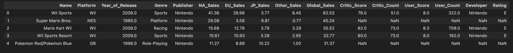

# Video Games Sales Analysis

**Video Games Sales Analysis** is a comprehensive data analysis tool designed to streamline data exploration, analysis, and visualisation. The tool supports multiple data formats and provides an intuitive interface for both novice and expert data scientists.

## Dataset Content

This dataset provides information about **video game sales, platforms, publishers, and review scores**, enabling analysis of market trends, platform performance, and the relationship between reviews and sales.

## Structure

* **Rows:** 16,719
* **Columns:** 16

| Column            | Data Type | Description                                                    |
| ----------------- | --------- | -------------------------------------------------------------- |
| `Name`            | `object`  | Title of the video game                                        |
| `Platform`        | `object`  | Platform(s) where the game was released (e.g., Wii, PS4, X360) |
| `Year_of_Release` | `float64` | Release year of the game (some missing values)                 |
| `Genre`           | `object`  | Game genre (e.g., Sports, Action, Role-Playing)                |
| `Publisher`       | `object`  | Company that published the game                                |
| `NA_Sales`        | `float64` | Sales in North America (millions of units)                     |
| `EU_Sales`        | `float64` | Sales in Europe (millions of units)                            |
| `JP_Sales`        | `float64` | Sales in Japan (millions of units)                             |
| `Other_Sales`     | `float64` | Sales in other regions (millions of units)                     |
| `Global_Sales`    | `float64` | Total worldwide sales (millions of units)                      |
| `Critic_Score`    | `float64` | Average critic review score (0–100)                            |
| `Critic_Count`    | `float64` | Number of critic reviews                                       |
| `User_Score`      | `float64` | Average user review score (0–10)                               |
| `User_Count`      | `float64` | Number of user ratings                                         |
| `Developer`       | `object`  | Company that developed the game                                |
| `Rating`          | `object`  | ESRB rating (e.g., E, T, M)                                    |

---

## Data Quality

* **Complete:** Sales columns (`NA_Sales`, `EU_Sales`, `JP_Sales`, `Other_Sales`, `Global_Sales`).
* **Partially missing:**

  * `Critic_Score` & `Critic_Count` — ~50%
  * `User_Score` & `User_Count` — ~55%
  * `Developer` & `Rating` — ~40%
  * `Year_of_Release` — 269 rows

---

## Example Records

---

### Notes

* Designed for **sales analysis**, **platform/vendor comparisons**, and **review impact studies**.
* Filtering may be required if focusing on games with critic or user review data.

---

## Business Requirements

The aim of this project is to clean, transform, and analyse historical video game sales data to support decision-making within the games industry.  
The key requirements are:

- **Understand sales performance** — Provide clear insights into global and regional sales trends (NA, EU, JP, Other) to identify high-performing games and platforms.
- **Platform strategy** — Compare sales across consoles and publishers to guide platform investment (e.g., Nintendo vs Sony vs Microsoft vs Other).
- **First-party vs third-party performance** — Identify how first-party titles perform compared with third-party titles to inform partnerships and exclusivity decisions.
- **Release planning** — Analyse the relationship between release year and sales to help forecast the potential success of upcoming game launches.
- **Data quality and consistency** — Clean and standardise raw data by handling missing values, merging duplicates, and creating derived features (e.g., `is_multiplatform`, `is_first_party`).
- **Flexible data exports** — Provide multiple cleaned CSV outputs for different analysis needs:
  - Sales-only dataset (no review data)
  - Merged multi-platform dataset (one row per title)
  - Review-focused dataset (only games with critic/user review data)

This analysis will help **publishers, developers, and analysts** make evidence-based decisions about platform focus, partnerships, and release timing.

## Hypothesis and how to validate

### Hypothesis 1 — **Critic reviews drive sales**

> Games with higher critic scores are associated with higher global sales.

* **Preparation:** Filter out rows with missing `Critic_Score`.
* **Validation:**

  * Visualise a scatter plot of `Critic_Score` vs `Global_Sales` with a regression line.
  * Bubble size represents `Critic_Count`.
* **Acceptance criteria:** A statistically significant positive correlation (p < 0.05) and a meaningful effect size (e.g., a 10-point increase in critic score results in a noticeable sales uplift).

---

### Hypothesis 2 — **User reviews drive sales**

> Games with higher user scores are associated with higher global sales.

* **Preparation:** Filter out rows with missing `User_Score`.
* **Validation:**

  * Scatter plot of `User_Score` vs `Global_Sales` with regression line.
  * Bubble size represents `User_Count`.
* **Acceptance criteria:** A statistically significant positive correlation (p < 0.05) between user score and sales.

---

### Hypothesis 3 — **Platform strength varies by region**

> Nintendo platforms outperform in Japan, while Sony and Microsoft dominate in North America and Europe.

* **Preparation:** Map platforms to vendors (Nintendo, Sony, Microsoft, Other).
* **Validation:**

  * Grouped bar charts of mean `JP_Sales`, `NA_Sales` and `EU_Sales` by vendor.
  * Use ANOVA and post-hoc Tukey tests to confirm differences between vendors.
* **Acceptance criteria:** Nintendo’s average sales are significantly higher in Japan, while Sony/Microsoft show higher averages in NA and EU.

---

### Hypothesis 4 — **Multi-platform advantage**

> Games released on multiple platforms sell more globally than single-platform titles.

* **Preparation:** Create a boolean column `is_multiplatform` (True if a game is available on ≥2 platforms).
* **Validation:**

  * Boxplots or violin plots comparing `Global_Sales` for multi-platform vs single-platform games.
* **Acceptance criteria:** Multi-platform games show significantly higher global sales (e.g., Mann–Whitney U or t-test).

---

### Hypothesis 5 — **First-party advantage**

> First-party games (published by the platform owner) outperform third-party titles on the same platform.

* **Preparation:** Create `is_first_party` column by checking if publisher matches platform owner (e.g., Nintendo on Wii/DS, Sony on PlayStation, Microsoft on Xbox).
* **Validation:**

  * Bar charts comparing mean `Global_Sales` for first-party vs third-party games, grouped by platform vendor.
* **Acceptance criteria:** First-party games have significantly higher mean sales on their respective platforms (t-test or Mann–Whitney U).

---

## Project Plan
* Outline the high-level steps taken for the analysis.
* How was the data managed throughout the collection, processing, analysis and interpretation steps?
* Why did you choose the research methodologies you used?

This project follows an **agile, sprint-based approach**, breaking the work into small, focused iterations to ensure quality, flexibility, and timely delivery. Early sprints concentrated on preparing and validating the dataset so that later sprints can focus on deeper analysis, hypothesis testing, and presenting insights effectively. The final deliverables include a fully cleaned and engineered dataset, validated analytical findings, and an interactive **Tableau dashboard**.

### Sprint Timeline

| Sprint                                                  | Date(s)         | Goals                                                                                                                                                                                         |
| ------------------------------------------------------- | --------------- | --------------------------------------------------------------------------------------------------------------------------------------------------------------------------------------------- |
| **Sprint 1 — ETL, Data Cleaning & Feature Engineering** | **07 Oct**      | Extract and import raw data, clean missing or invalid values, drop unused fields, convert column types, and create new engineered features (`is_multiplatform`, `is_first_party`).            |
| **Sprint 2 — Data Validation & Quality Checks**         | **08 Oct**      | Validate the integrity of the cleaned dataset (check for duplicates, outliers, and inconsistencies) and confirm the correctness of new features.                                              |
| **Sprint 3 — Exploratory Analysis & Visualisation**     | **08 – 09 Oct** | Explore sales trends by region, platform, and publisher. Build quick visualisations to understand distributions and relationships between key variables. Prepare data for Tableau dashboards. |
| **Sprint 4 — Hypothesis Testing & Insights**            | **10 Oct**      | Statistically test hypotheses such as *reviews driving sales*, *multi-platform advantage*, and *first-party vs third-party performance*. Summarise findings and actionable insights.          |
| **Sprint 5 — Dashboard Development**                    | **11 – 12 Oct** | Build an interactive Tableau dashboard to present sales patterns, platform comparisons, and review-driven trends in a clear, business-friendly format.                                        |
| **Sprint 6 — Documentation & Wrap-up**                  | **13 Oct**      | Finalise the README with business requirements, methodology, and insights. Export cleaned CSV datasets and prepare the project for handover or stakeholder review.                            |

## The rationale to map the business requirements to the Data Visualisations
* List your business requirements and a rationale to map them to the Data Visualisations

## Analysis techniques used
* List the data analysis methods used and explain limitations or alternative approaches.
* How did you structure the data analysis techniques. Justify your response.
* Did the data limit you, and did you use an alternative approach to meet these challenges?
* How did you use generative AI tools to help with ideation, design thinking and code optimisation?

## Ethical considerations
* Were there any data privacy, bias or fairness issues with the data?
* How did you overcome any legal or societal issues?

## Dashboard Design
* List all dashboard pages and their content, either blocks of information or widgets, like buttons, checkboxes, images, or any other item that your dashboard library supports.
* Later, during the project development, you may revisit your dashboard plan to update a given feature (for example, at the beginning of the project you were confident you would use a given plot to display an insight but subsequently you used another plot type).
* How were data insights communicated to technical and non-technical audiences?
* Explain how the dashboard was designed to communicate complex data insights to different audiences. 

## Unfixed Bugs
* Please mention unfixed bugs and why they were not fixed. This section should include shortcomings of the frameworks or technologies used. Although time can be a significant variable to consider, paucity of time and difficulty understanding implementation are not valid reasons to leave bugs unfixed.
* Did you recognise gaps in your knowledge, and how did you address them?
* If applicable, include evidence of feedback received (from peers or instructors) and how it improved your approach or understanding.

## Development Roadmap
* What challenges did you face, and what strategies were used to overcome these challenges?
* What new skills or tools do you plan to learn next based on your project experience? 

## Main Data Analysis Libraries
* Here you should list the libraries you used in the project and provide an example(s) of how you used these libraries.

## Credits 

* In this section, you need to reference where you got your content, media and extra help from. It is common practice to use code from other repositories and tutorials, however, it is important to be very specific about these sources to avoid plagiarism. 
* You can break the credits section up into Content and Media, depending on what you have included in your project. 

### Content 

- The text for the Home page was taken from Wikipedia Article A
- Instructions on how to implement form validation on the Sign-Up page was taken from [Specific YouTube Tutorial](https://www.youtube.com/)
- The icons in the footer were taken from [Font Awesome](https://fontawesome.com/)

### Media

- The photos used on the home and sign-up page are from This Open-Source site
- The images used for the gallery page were taken from this other open-source site

## Acknowledgements (optional)
* Thank the people who provided support through this project.

## Additional Information & Definitions

### Core Statistical Concepts

* **Mean** — Average of all values; shows the dataset’s centre. *(Add up all values and divide by how many there are)*
* **Median** — Middle value when data are ordered. *(Put numbers in order; pick the middle one — if even count, average the two middle ones)*
* **Standard Deviation (SD)** — How spread out values are around the mean. *(Work out how far each value is from the mean on average)*
* **Probability** — Likelihood of an event. *(Number of ways something can happen ÷ total possible outcomes; between 0 and 1)*
* **Hypothesis Testing** — Checks if a pattern or difference is likely real or just chance. *(Start with “no difference” and test against your data)*
* **t-Test** — Compares the averages of two groups to see if any difference is meaningful, not just random.

**Why it matters:** These basics help summarise data, see how reliable it is, and make informed decisions from evidence.
